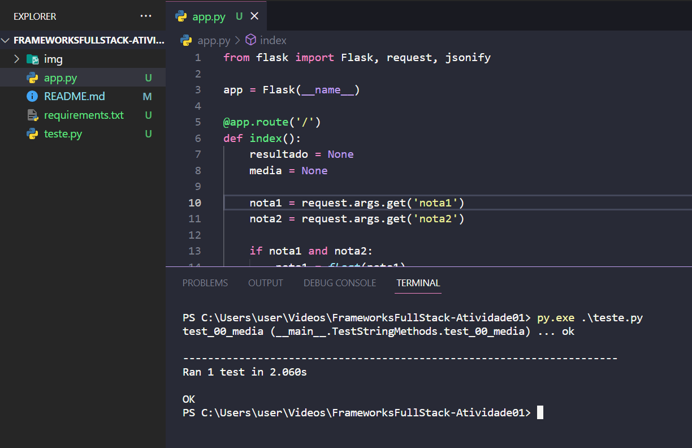
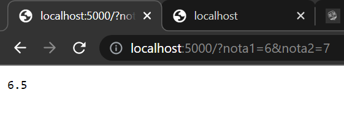

# Frameworks FullStack - AC1

Criar uma um backend que contenha uma rota, essa rota deverá receber 2 parâmetros ( duas notas do aluno) e exibir essa nota com a media aplicada.

Exemplo: nota1 + nota2 /2

Colocar esse backend no repositório GIT e preencher o formulário da atividade com a URL.

## Teste Executado 

  
  

